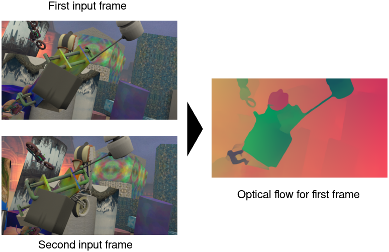

# FlowNet 2.0 Docker Image

This repository contains a Dockerfile and scripts to build and run neural networks for optical flow estimation in Docker containers. We also provide some example data to test the networks. 

If you use this project or parts of it in your research, please cite the original paper of Flownet 2.0:

    @InProceedings{flownet2,
      author       = "E. Ilg and N. Mayer and T. Saikia and M. Keuper and A. Dosovitskiy and T. Brox",
      title        = "FlowNet 2.0: Evolution of Optical Flow Estimation with Deep Networks",
      booktitle    = "IEEE Conference on Computer Vision and Pattern Recognition (CVPR)",
      month        = "Jul",
      year         = "2017",
      url          = "http://lmb.informatik.uni-freiburg.de//Publications/2017/IMKDB17"
    }

See the [paper website](https://lmb.informatik.uni-freiburg.de/Publications/2017/IMKDB17) for more details.

## 0. Requirements

We use [nvidia-docker](https://github.com/NVIDIA/nvidia-docker#quick-start) for reliable GPU support in the containers. This is an extension to Docker and can be easily installed with just two commands.

To run the FlowNet2 networks, you need an Nvidia GPU (at least Kepler). For the smaller networks (e.g. *FlowNet2-s*) 1GB of VRAM is sufficient, while for the largest networks (the full *FlowNet2*) at least **4GB** must be available. A GTX 970 can handle all networks.

## 1. Building the FN2 Docker image

Simply run `build.sh`. This will create two Docker images: The OS base (an Ubuntu 14.04 base extended by Nvidia, with CUDA 7.5), and the "flownet2" image on top. In total, about 8.5GB of space will be needed after building. Build times are a little slow.

## 2. Running FN2 containers

Make sure you have read/write rights for the current folder. Run the `run-network.sh` script. It will print some help text, but here are two examples to start from:

### 2.1 Optical flow for two single images
- we use the full *FlowNet2* variant for maximum accuracy
- we assume that we are on a single-GPU system
- we want debug outputs, but not the whole network stdout

> $ ./run-network.sh -n FlowNet2 -v data/0000000-imgL.png data/0000001-imgL.png flow.flo

### 2.2 Optical flow for entire lists of images
- we use the lean *FlowNet2-s* variant for maximum speed
- we want to use GPU "1" on a multi-GPU system
- we want to see the full network stdout printfest

> $ ./run-network.sh -n FlowNet2-s -g 1 -vv data/flow-first-images.txt data/flow-second-images.txt data/flow-outputs.txt

**NOTE:** All the network outputs will be files belonging to "root".  As a regular user, you cannot change these files, but you can copy them to files that belong to you, and then delete the originals:

    $ cp 0000000-flow.flo user-owned-0000000-flow.flo
    $ rm 0000000-flow.flo

## 3. License
The files in this repository are under the [GNU General Public License v3.0](LICENSE)

